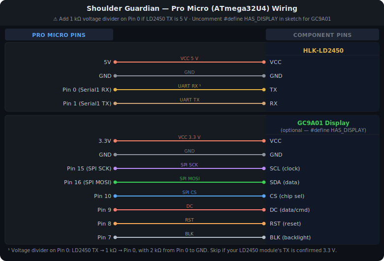
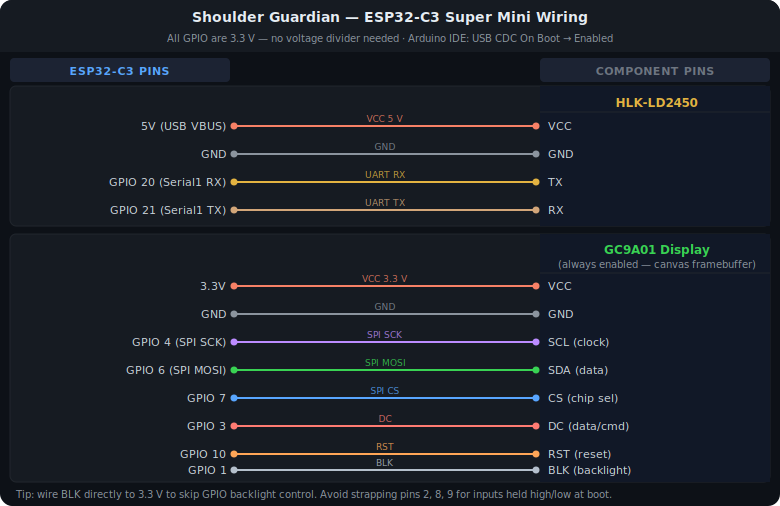
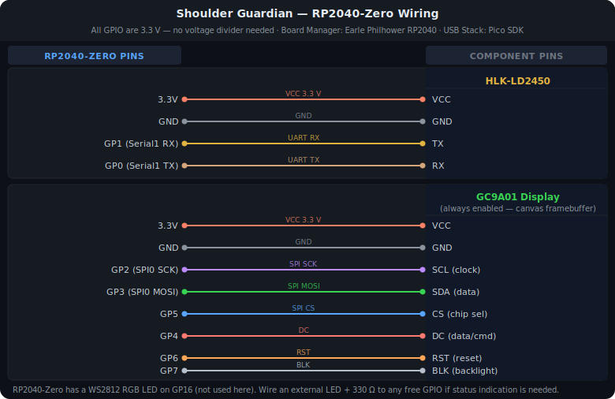

# Shoulder Guardian — Wiring Reference

Three supported microcontroller boards. All run the same Electron app — just connect to whichever COM port appears.

---

## Board comparison

| | Pro Micro (ATmega32U4) | ESP32-C3 Super Mini | RP2040-Zero |
|---|---|---|---|
| **Sketch** | `arduino/shoulder_surfer` | `arduino/shoulder_surfer_esp32` | `arduino/shoulder_surfer_rp2040` |
| **SRAM** | 2.5 KB | 400 KB | 264 KB |
| **Display** | Optional (`#define HAS_DISPLAY`) | Always on | Always on |
| **Framebuffer** | No — selective redraw | ✅ Full canvas | ✅ Full canvas |
| **VCC for LD2450** | **5 V** | 3.3 V | 3.3 V |
| **Voltage divider on RX?** | ⚠ Yes if LD2450 TX is 5 V | ✗ Not needed | ✗ Not needed |
| **SPI speed** | ~8 MHz | 80 MHz | 62.5 MHz |
| **Arduino board name** | Arduino Pro Micro | ESP32C3 Dev Module | Waveshare RP2040 Zero |

---

## Wire colour legend

| Colour | Signal |
|--------|--------|
| 🔴 Red | VCC power |
| ⚫ Grey | GND |
| 🟡 Yellow | UART RX (board ← sensor TX) |
| 🟠 Tan | UART TX (board → sensor RX) |
| 🟣 Purple | SPI SCK (clock) |
| 🟢 Green | SPI MOSI (data out) |
| 🔵 Blue | SPI CS (chip select) |
| 🩷 Coral | DC (data/command) |
| 🟠 Amber | RST (reset) |
| ⬜ Silver | BLK (backlight) |

---

## Pro Micro (ATmega32U4)

> **⚠ Voltage divider on Pin 0:** The LD2450 TX line may be 5 V.
> Add a 1 kΩ resistor between LD2450 TX and Pin 0, and a 2 kΩ resistor from Pin 0 to GND.
> Most HLK modules are confirmed 3.3 V — check your specific module's datasheet before skipping this.

> **Display is optional.** Uncomment `#define HAS_DISPLAY` in the sketch and install
> *Arduino_GFX_Library by Moon On Our Nation* from the Library Manager.

---

## ESP32-C3 Super Mini

> **Arduino IDE settings:** Board → `ESP32C3 Dev Module` · **USB CDC On Boot → Enabled** (required for Serial over USB)

> Avoid using GPIO 2, 8, or 9 for signals that are driven HIGH or LOW at boot — these are strapping pins.
> BLK (GPIO 1) can be wired directly to 3.3 V to skip GPIO backlight control.

---

## RP2040-Zero

> **Arduino IDE settings:** Board Manager → *Raspberry Pi Pico/RP2040 by Earle Philhower* · Board → `Waveshare RP2040 Zero` · USB Stack → `Pico SDK`

> The RP2040-Zero has a WS2812 RGB LED on GP16 — not a plain LED.
> The sketch defaults `LED_PIN` to GP25 (not broken out on the Zero, acts as a safe no-op).
> Wire an LED + 330 Ω to any free GPIO and update `LED_PIN` if you want status indication.

---

## Required library (all three boards)

**Arduino_GFX_Library** by Moon On Our Nation  
Arduino IDE → Sketch → Include Library → Manage Libraries → search `Arduino_GFX_Library` → Install
